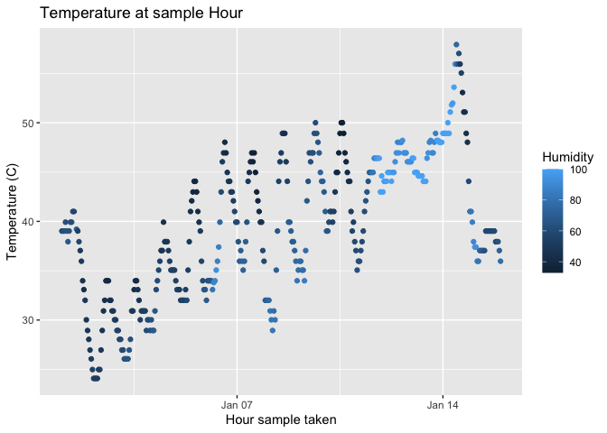

p8105_hw1_jl5934
================
Jesus Luevano
2023-09-18

``` r
library(moderndive)
library(tidyverse)
```

    ## ── Attaching core tidyverse packages ──────────────────────── tidyverse 2.0.0 ──
    ## ✔ dplyr     1.1.3     ✔ readr     2.1.4
    ## ✔ forcats   1.0.0     ✔ stringr   1.5.0
    ## ✔ ggplot2   3.4.3     ✔ tibble    3.2.1
    ## ✔ lubridate 1.9.2     ✔ tidyr     1.3.0
    ## ✔ purrr     1.0.2     
    ## ── Conflicts ────────────────────────────────────────── tidyverse_conflicts() ──
    ## ✖ dplyr::filter() masks stats::filter()
    ## ✖ dplyr::lag()    masks stats::lag()
    ## ℹ Use the conflicted package (<http://conflicted.r-lib.org/>) to force all conflicts to become errors

# Problem 1

## Access the dataset

We will load the ‘early_january_weather’ dataset.

``` r
data("early_january_weather")
```

## Describing the Dataset

We will then run commands to evaluate the variables and some basic
statistics on them.

The variables of the dataset are origin, year, month, day, hour, temp,
dewp, humid, wind_dir, wind_speed, wind_gust, precip, pressure, visib,
time_hour.

The size of the dataset is 358 rows by 15 columns.

The samples are all originating from the site EWR, during the month of
January 2013. The days range from 1-15, suggesting they were collected
the first half of the month. The samples hours from 0-23 to represent a
24 hour day.

The mean temperature of the 385 observations in the dataset is
39.5821229 degrees Celsius, with a standard deviation of 7.058637
degrees Celsius.

In addition, the mean dew point of the dataset is 28.057095, mean
humidity of the dataset is 65.4767039, mean wind speed is 8.2258269,
mean precipitation is 0.0020391, and mean visbility was 8.5153352.

Because there were ‘NA’ values in both wind gust, wind direction, and
pressure, the means could not be calculated without dealing with those
missing values.

## Making the scatterplot

We will make a scatterplot evaluating the temperature (C) by time hour
it was collected. We will also color code by humidity.

``` r
scatter_df <- tibble(
  x = pull(early_january_weather, time_hour),
  y = pull(early_january_weather, temp)
) 

ggplot(scatter_df, aes(x = x, y = y, color = pull(early_january_weather, humid))) + geom_point() + 
  xlab("Hour sample taken") + ylab("Temperature (C)") + labs(title="Temperature at sample Hour", color = "Humidity")
```

<!-- -->

Looking at the scatterplot there is a general increase in temperature as
time hour it was taken increases, but it is not a pure linear
relationship as it somewhat oscillates. In addition, when color-coded by
humidity we see that the humidity also seems to increase with the time
hour that the sample was taken.

## Saving the plot.

``` r
ggsave("scatterplot_problem1.pdf", height = 4, width = 6)
```

# Problem 2

## Constructing the dataframe

``` r
set.seed(817)

df_2 = tibble(
  norm_sample = rnorm(10, mean = 1), 
  norm_sample_pos = norm_sample > 0,
  char = "helloworld",
  factor = factor(c("first", "second", "third", "first", "second", "third", "first", "second", "third", "first"), levels = c("first", "second", "third"))
)
```

## Means values from the dataframe

The mean of the random sample of normal distribution is 1.3578987.

The mean of the logical vector is 0.8.

The mean of the character vector is NA when attempted via NA

The mean of the factor vector is NA when attempted via “r
mean(pull(df_2, factor))”

## Changing data type

``` r
df_2$char = as.numeric(as.character(pull(df_2, char)))

df_2$factor =  as.numeric(as.factor(pull(df_2, factor)))
```

When we try to convert the character vector into a numeric one, it is
unable to and coerces them all to NA. However when we attempt it with
the factor level it is able to convert it to numeric, assigning values
from 1-3 based on the factor level it was originally.
